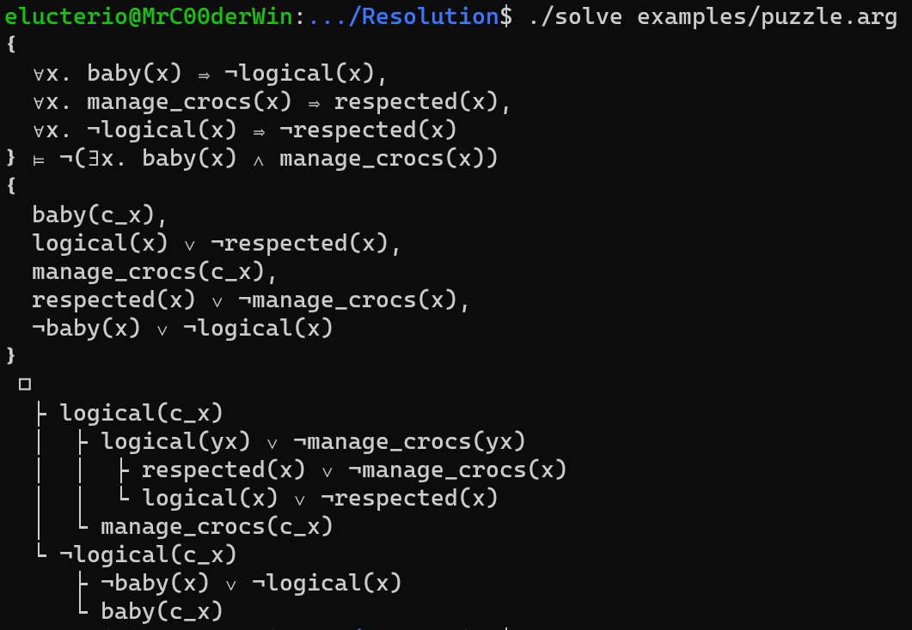

# First order formula prover using resolution

Solver used to help students practice resolution proofs:
```bash
make
./solve examples/puzzle.arg
```

This solver is based on the book [Handbook of Practical Logic and Automated Reasoning](https://www.cambridge.org/core/books/handbook-of-practical-logic-and-automated-reasoning/EB6396296813CB562987E8C37AC4520D)

